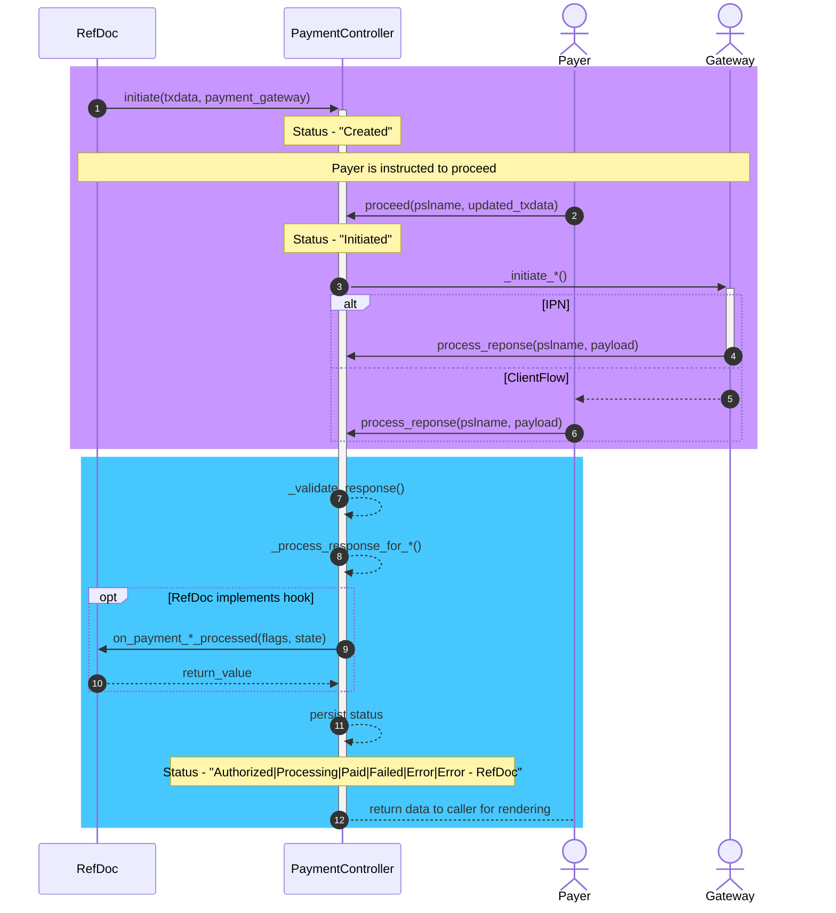

# Architecture

The Payment app provides an abstract _PaymentController_ and specific implementations for a growing number of gateways.
These implementations are located inside the _Payment Gateways_ module.

Inside the _Payment_ module, an additional _Payment Gateway_ DocType serves as the link target to a reference DocType (RefDoc, see below) for the respective payment gateway controller and settings. For example, the _Payment Request_ DocType links to this _Payment Gateway_ in order to implement its payment flow.

Furthermore, upon installation, the app adds custom fields to the Web Form for facilitating web form based payments as well as a reference to the _Payment Session Log_ to the _Payment Request_ and removes them upon uninstallation.

## Relation between RefDoc and Payment Gateway Controller

The reference document implements the surrounding business logic, links to the _Payment Gateway_, and calls out &mdash; typically on submit &mdash; to the specific _PaymentController_ for initiating and handling the transaction.

After the transaction has been handled, the reference document may do post-processing in business logic via one of the available hook methods on the result and remit a specific payload (e.g., redirect link / success message) to the _PaymentController_.

During the entire lifecycle of a payment, state is maintained on the _Payment Session Log_ DocType. It allows persisting free-form data and serves as a central log for interaction with remote systems.

### TXData, TX Reference and Correlation ID

The data is passed from the RefDoc to the _PaymentController_ via a standardized data structure called _TXData_.

Then, all transaction lifecycle state is stored into a _Payment Session Log_.

The _Name_ of the _Payment Session Log_ will be the system's unique transaction reference to identify a payment transaction across its lifecycle and needs to be always passed around between the server, the client and remote systems. It may be typically stored in a gateway's request metadata in such a way that it is always returned by the remote server in order to reliably identify the transaction.

A payment gateway's _Correlation ID_, if available, is set as the _Payment Session Log_'s `correlation_id`. If a gateway uses it for fault-tolerant deduplication, a controller should send this ID to the remote server in any request throughout the remainder of a TX lifecycle.

If the remote server only returns a _Correlation ID_ but is unable to carry the _Payment Session Log_ name, then implementations can work around and recover the _Payment Session Log_ name, which is required by the controller methods, by filtering payment session logs on `{"correlation_id": correlation_id}`.

### RefDoc Flow

1. Call the _PaymentController_'s `initiate` `staticmethod` with with `tx_data` and eventually any pre-selected _Payment Gateway_, store the returning _Payment Session Log_ for further reference.
2. If called with a pre-selected _Payment Gateway_, use the returned `controller` from the previous step to call its `is_user_flow_initiation_delegated` method with the name of the _Payment Session Log_. If returning `True`, it means that the controller takes over the flow, if `False` the business logic on the RefDoc is in charge of the next steps.
4. If the user flow initiation is not delegated (to the controller): initiate/continue user flow, e.g., via Email, SMS, WhatsApp, Phone Call, etc.
5. post-process the payment status change via `on_payment_{mandate_acquisition,mandated_charge,charge}_processed` with a two-fold goal:
   - Continue business logic in the backend
   - Optional: return business-logic-specific `{"message": _("..."), "action": {"href": "...", "label": _("...")}}` to the controller, where:
     - `message` is shown to the used
     - `action` is rendered into the call to action after completing the payment
     - If nothing is returned, the gateway's (if implemented) or app's standard is used

### PaymentController Flow

The _PaymentController_ flow has knowledge of the following flow variants:

- Charge: a single payment
- Mandate Acquisition: acquire a mandate for present or future mandated charges
- Mandated Charge: a single payment that requires little or no user interaction thanks to a mandate

A mandate represents some sort of pre-authorization for a future (mandated) charge. It can be used in diverse use cases such as:

- Subscription
- SEPA Mandate
- Preauthorized Charge ("hotel booking")
- Tokenized Charge ("one-click checkout")

Taking the flow variants into account, the high level control flow looks like this:

1. Eventually throw on `initiate` if `validate_tx_data` throws, if there's an issue.
2. Wait for the user GO signal (e.g., via link, call, SMS, click), then `proceed`. We delay remote interactions as much as possible in order to:
   - Initialize timeouts as late as possible
   - Offer the customer choices until the last possible moment (among others: mandate vs charge)
   - The controller can change the _TX Data_ with the user input
3. Based on this most recent _TX Data_: decide whether to initiate a Charge, a Mandate Acquisition, or a Mandated Charge. Mandate Acquisition is typically implemented as a pre-processing step of a Mandated Charge.
4. Initiate the flow via the dedicated method `_initiate_*` method and the updated _TX Data_.
6. Manage the actual payment capture along the user flow in collaboration with the payment gateway.
7. Process the result via the dedicated method `_process_response_for_{charge,mandated_charge,mandate_acquisition}`:
   - Validate the response payload via `_validate_response_payload`, for example, check the integrity of the message against a pre-shared key.
8. Invoke the RefDoc's `on_payment_{mandate_acquisition,mandated_charge,charge}_processed()` method and manage the finalization user flow (e.g., via message and redirect).

### Schematic Overview

### Sequence Diagram

> **Notes:**
>
> - A server-to-server response from the gateway and a signed payload via the client flow may occur in parallel.
> - Thus, the blue area is expected to be **idempotent**
> - A processing lock only ensures that no parallel processing would lead to a race

### And my Payment URL?

The payment URL is a well-known URL with a `s` query parameter and the page at that URL can be used for capturing the user's GO signal to the Payment controller flow.

It is kept short, tidy, and gateway-agnostic in order to impress succinct trustworthiness on the user.

Format: `https://my.site.tld/pay?s=<Payment Session Log Name>`.

## Other Folders

All general utils are stored in the [utils](payments/utils) directory. The utils are written in [utils.py](payments/utils/utils.py) and then imported into the [`__init__.py`](payments/utils/__init__.py) file for easier importing/namespacing.

The [overrides](payments/overrides) directory has all the overrides for overriding standard Frappe code. Currently, it overrides the WebForm DocType controller as well as a WebForm whitelisted method.

The [templates](payments/templates) directory has all the payment gateways' custom checkout pages.

The file [`payments/types.py`](`payments/types.py) define relevant types and dataclasses for ease of developing new integrations with an IDE.
The relevant exceptions of this app can be found in [`payments/exceptions.py`](payments/exceptions.py).

The _Payment Controller_ base class is implemented in [`payments/controllers/payment_controller.py`](payments/controllers/payment_controller.py) and a unified checkout page is implemented in [`payments/www/pay.js`](payments/www/pay.js), [`payments/www/pay.css`](payments/www/pay.css), [`payments/www/pay.html`](payments/www/pay.html) and [`payments/www/pay.py`](payments/www/pay.py), respectively.

